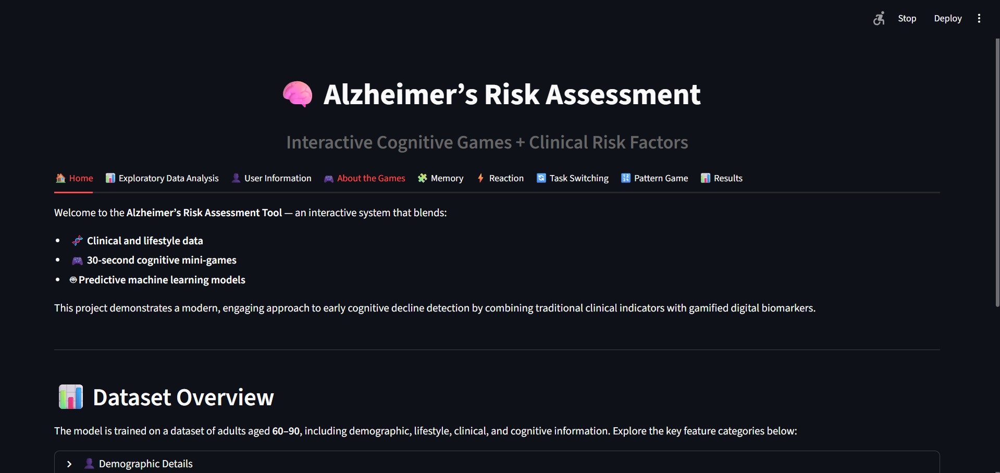
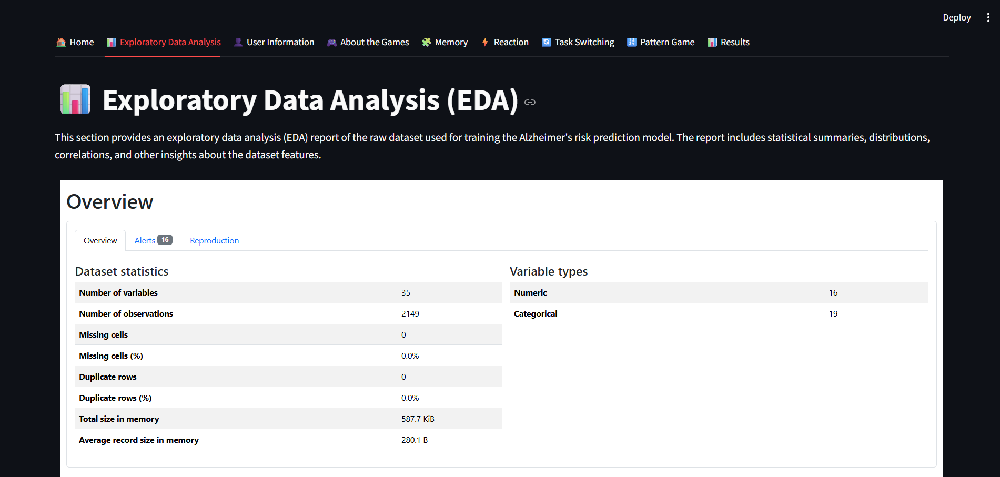
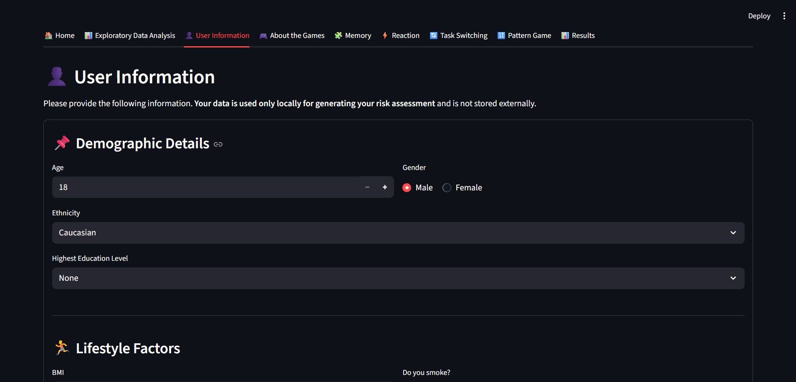
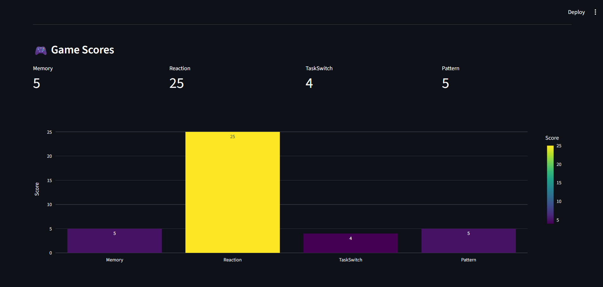
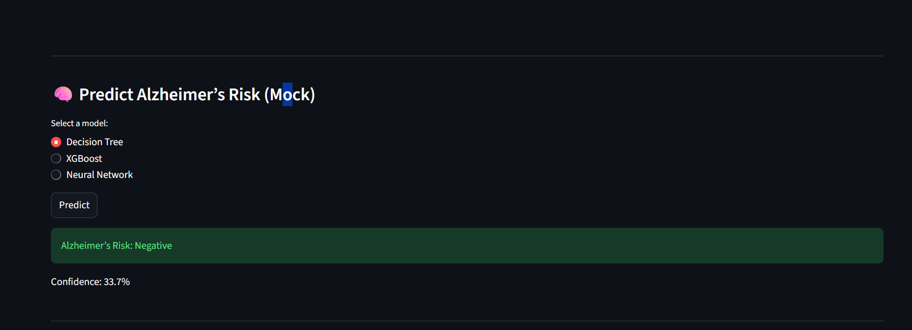

# Alzheimer-s-detection-DSP

### Data overview
The dataset used in this project is sourced from Kaggle and can be found at the following link 
[Alzheimer's Dataset on Kaggle](https://www.kaggle.com/datasets/rabieelkharoua/alzheimers-disease-dataset?select=alzheimers_disease_data.csv).

### Project Description
This project focuses on the detection of Alzheimer's disease using interactive cognitive tests. The dataset contains various features related to cognitive performance, demographics, and health indicators. The goal is to build a machine learning model that can accurately classify individuals into different stages of Alzheimer's disease based on these features.

### Features
The dataset includes the following key features:
#### Patient Information
| Feature       | Description                                                   |
| ------------- | ------------------------------------------------------------- |
| **PatientID** | A unique number assigned to each patient (range: ~4751–6900). |

#### Demographic Details
| Feature            | Description                                                                                                            |
| ------------------ | ---------------------------------------------------------------------------------------------------------------------- |
| **Age**            | Age in years (60–90). Alzheimer’s risk increases with age.                                                             |
| **Gender**         | 0 = Male, 1 = Female.                                                                                                  |
| **Ethnicity**      | 0 = Caucasian, 1 = African American, 2 = Asian, 3 = Other.                                                             |
| **EducationLevel** | 0 = None, 1 = High School, 2 = Bachelor’s, 3 = Higher. Higher education is often protective against cognitive decline. |

#### Lifestyle Factors
| Feature                | Description                              |
| ---------------------- | ---------------------------------------- |
| **BMI**                | Body Mass Index (15–40).                 |
| **Smoking**            | 0 = No, 1 = Yes.                         |
| **AlcoholConsumption** | Weekly alcohol intake (0–20 units).      |
| **PhysicalActivity**   | Weekly hours of exercise (0–10).         |
| **DietQuality**        | Score from 0–10. Higher is better.       |
| **SleepQuality**       | Score from 4–10, indicates rest quality. |

#### Medical History
| Feature                     | Description      |
| --------------------------- | ---------------- |
| **FamilyHistoryAlzheimers** | 0 = No, 1 = Yes. |
| **CardiovascularDisease**   | 0 = No, 1 = Yes. |
| **Diabetes**                | 0 = No, 1 = Yes. |
| **Depression**              | 0 = No, 1 = Yes. |
| **HeadInjury**              | 0 = No, 1 = Yes. |
| **Hypertension**            | 0 = No, 1 = Yes. |

These conditions have known associations with increased Alzheimer’s risk.

#### Clinical Measurements
| Feature                      | Unit / Range  | Notes              |
| ---------------------------- | ------------- | ------------------ |
| **SystolicBP**               | 90–180 mmHg   |                    |
| **DiastolicBP**              | 60–120 mmHg   |                    |
| **CholesterolTotal**         | 150–300 mg/dL |                    |
| **CholesterolLDL**           | 50–200 mg/dL  | "Bad cholesterol"  |
| **CholesterolHDL**           | 20–100 mg/dL  | "Good cholesterol" |
| **CholesterolTriglycerides** | 50–400 mg/dL  |                    |

#### Cognitive & Functional Assessments
| Feature                  | Description                                                  |
| ------------------------ | ------------------------------------------------------------ |
| **MMSE**                 | Mini-Mental State Examination (0–30). Lower = impairment.    |
| **FunctionalAssessment** | Score 0–10. Lower = daily functioning impairment.            |
| **MemoryComplaints**     | 0 = No, 1 = Yes.                                             |
| **BehavioralProblems**   | 0 = No, 1 = Yes.                                             |
| **ADL**                  | Activities of Daily Living score (0–10). Lower = difficulty. |

#### Symptoms
| Symptom                       | Meaning          |
| ----------------------------- | ---------------- |
| **Confusion**                 | 0 = No, 1 = Yes. |
| **Disorientation**            | 0 = No, 1 = Yes. |
| **PersonalityChanges**        | 0 = No, 1 = Yes. |
| **DifficultyCompletingTasks** | 0 = No, 1 = Yes. |
| **Forgetfulness**             | 0 = No, 1 = Yes. |

#### Diagnosis Information
| Feature       | Description                                                                |
| ------------- | -------------------------------------------------------------------------- |
| **Diagnosis** | Alzheimer’s diagnosis (0 = No, 1 = Yes). This is the model’s target label. |

## UI Samples

