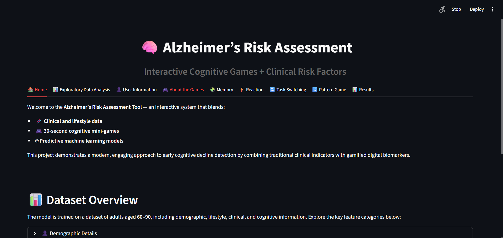
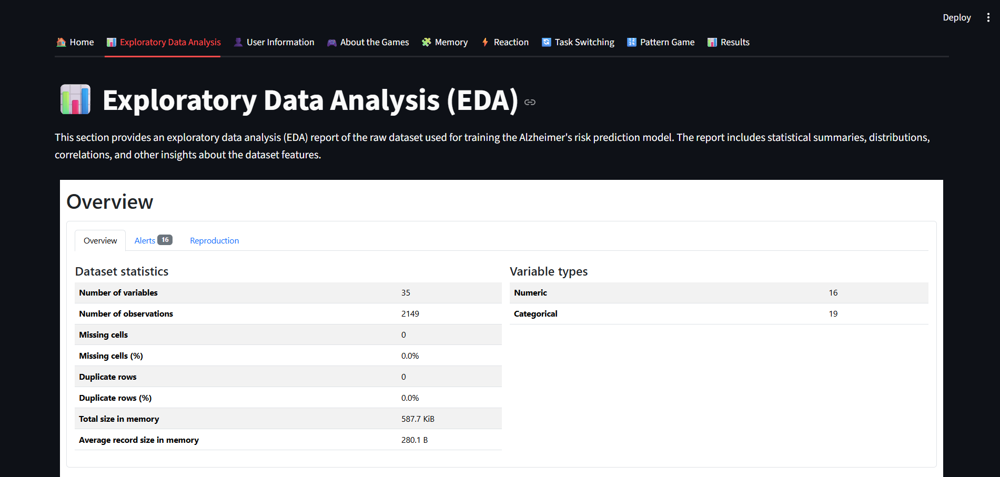
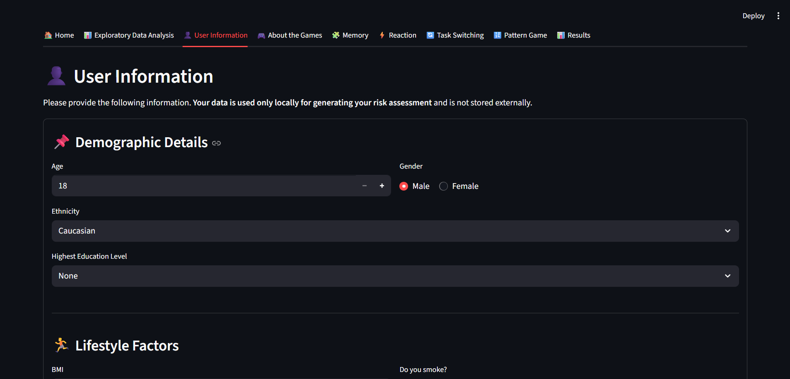
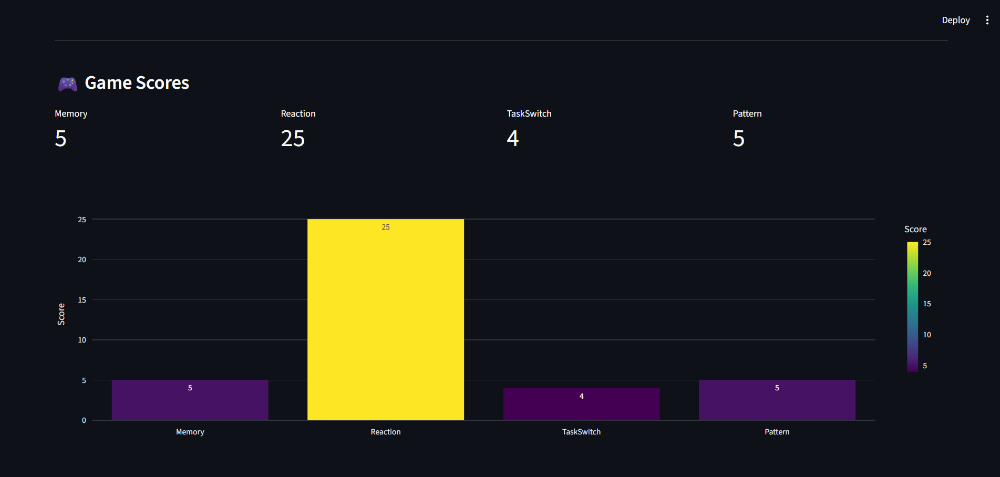
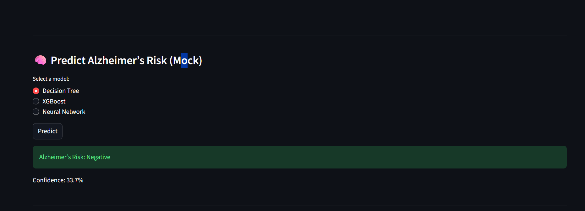

# Alzheimer’s Disease Detection using Clinical & Cognitive Data

### Data overview
The dataset used in this project is sourced from Kaggle and can be found at the following link 
[Alzheimer's Dataset on Kaggle](https://www.kaggle.com/datasets/rabieelkharoua/alzheimers-disease-dataset?select=alzheimers_disease_data.csv).

## Team Members
- **Manoj Bhausaheb Kokane** — Roll No: *(24871)*
- **Parth Bhatia** — Roll No: *(24665)*
- **Swapnil Trivedi** — Roll No: *(24723)*

---

## 📌 Problem Statement
Early detection of Alzheimer’s Disease (AD) is critical for timely clinical intervention, care planning, and slowing disease progression. Current diagnosis relies heavily on cognitive examinations and imaging, which are expensive, time-consuming, and not scalable for large populations.

This project aims to build a **binary classification model** capable of distinguishing Alzheimer’s patients from healthy controls using:
- Structured clinical data (demographics, medical history, vitals)
- Functional and cognitive assessment scores
- Game-based cognitive performance metrics

The goal is to provide a **lightweight, interpretable, and high-accuracy screening tool** suitable for real-world clinical environments.

---

## 📊 Dataset Description
The dataset consists of **2,150 patient records** with **32 features**, including:

### **1. Demographics**
- Age, gender, ethnicity

### **2. Lifestyle Factors**
- Sleep quality, physical activity, diet metrics

### **3. Medical History**
- Hypertension, cardiovascular disease, diabetes, depression, traumatic brain injury, family history

### **4. Cognitive & Functional Assessments**
- MMSE (Mini-Mental State Examination)
- Activities of Daily Living (ADL)
- Functional Assessment (FA)
- Behavioral and memory complaints

### **5. Cognitive Game Metrics**
Quantitative scores from four designed mini-games:
- Memory Sequence Recall
- Pattern Completion
- Reaction Time Test
- Task Switching

**Class distribution:**  
- 65% Healthy (n = 1,397)  
- 35% Alzheimer’s (n = 753)

Dataset had **no missing values**, no duplicates, and minimal multicollinearity.

---

## 🧠 High-Level Approach & Methods

### **1. Data Preprocessing**
- Stratified 80:20 train-test split
- Standard scaling for continuous features
- Validation against out-of-range or invalid entries
- Retained all 32 clinically-relevant features

### **2. Exploratory Data Analysis**
- Distribution analysis of age, lifestyle, and cognitive scores
- Correlation heatmaps
- Statistical validation: t-tests, chi-square tests
- Top features identified: FA, ADL, MMSE, Memory Complaints, Behavioral Problems

### **3. Model Development**
Multiple models were developed and compared:

#### ✔ Neural Network (PyTorch)
- Architecture: 32–64–32–16–1  
- Accuracy: **84.65%**

#### ✔ Random Forest
- Tuned with GridSearchCV  
- Accuracy: **94.42%**

#### ✔ **XGBoost (Final Production Model)**
- Extensive hyperparameter optimization
- Best overall performance & compact size (1.2 MB)

### **4. Model Interpretability**
- Global feature importance (XGBoost & Random Forest)
- SHAP values integrated into UI for patient-level explanations

### **5. Production Deployment**
- Built using **Streamlit**
- Includes:
  - Input validation
  - Real-time probability output
  - Risk tier mapping (Very Low → Very High)
  - SHAP interpretability

---

## ⭐ Summary of Results

### **Final Model: XGBoost Classifier**
| Metric | Score |
|--------|--------|
| **Accuracy** | 95.12% |
| **ROC-AUC** | 94.34% |
| **Precision** | 94.56% |
| **Recall (Sensitivity)** | 91.45% |
| **Specificity** | 95.7% |
| **F1 Score** | 92.98% |

### **Key Findings**
- Cognitive & functional assessments dominate predictive power (≈66% contribution).
- Lifestyle factors add value through second-order interactions.
- Model has a **very low false-negative rate**, essential for medical screening.
- Production model runs at **~20,000 samples/sec** on standard CPU and is highly scalable.

### **Clinical Relevance**
- Provides a fast, low-cost screening tool for early detection.
- Enhances decision-making with interpretable SHAP explanations.
- Deployable in resource-limited clinical settings.

---

## UI Samples

